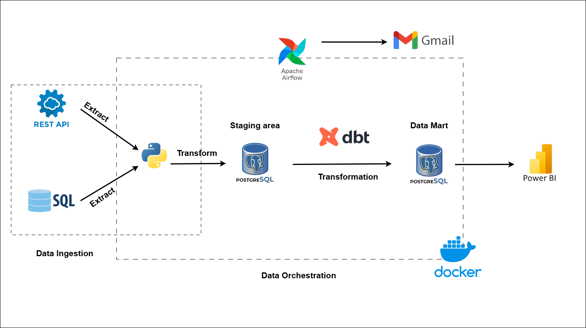

# DATA_VISUALIZATION PROJECT

## 🧩 Overview

The **Data Visualization Project** is designed to extract, process, and visualize data from multiple sources such as **SQL Server** and **REST APIs**.

It follows a fully automated **ELT (Extract – Load – Transform)** pipeline, orchestrated by **Apache Airflow**, with **dbt** transformations triggered directly within the DAG.

All components are containerized and managed using **Docker Compose** for easy deployment and consistent environments.

---

## 🔧 Technologies Used

- **Apache Airflow** – Workflow orchestration and ETL automation  
- **dbt (Data Build Tool)** – Data transformation & model building  
- **PostgreSQL** – Data Mart  
- **pgAdmin** – UI tool to monitor/query PostgreSQL  
- **SQL Server** – Raw data source (restored from `.bak`)  
- **Docker Compose** – Container orchestration  
- **`.env`** – Store all configuration variables and credentials  

---

## Project Structure

```
DATA_VISUALIZATION/
├── airflow/                  # Airflow-related configs and DAGs
│   ├── config/              # Airflow configuration files
│   ├── dags/                # DAG definitions
│   │   └── etl_multi_source.py
│   ├── logs/                # Airflow logs
│   ├── plugins/             # Optional custom plugins
│   └── Dockerfile           # Airflow service image
│
├── backup/                  # SQL Server backup files (.bak)
│
├── dbt_project/
│   ├── dbt_packages/        # Package dependencies
│   ├── logs/                # dbt logs
│   ├── macros/              # Custom dbt macros
│   ├── models/
│   │   ├── marts/           # Fact/dimension models
│   │   └── staging/         # Staging models
│   ├── profiles/
│   │   ├── .user.yml
│   │   └── profiles.yml
│   ├── target/              # Compiled dbt artifacts
│   ├── dbt_project.yml      # Project config
│   └── package-lock.yml
│
├── .env                     # Environment config (generated from .env.example)
├── .env.example             # Template for environment variables
├── .gitignore               # Files to ignore in Git
├── docker-compose.yml       # Docker Compose configuration
└── README.md                # This documentation file
```

---

## ⚙️ Setup and Execution

### 1. Clone the Repository

```bash
git clone https://github.com/<your-username>/loan-intelligence-platform.git
cd data_visualization
```

### 2. Configure Environment Variables

```bash
cp .env.example .env
```

> Then update `.env` with your own values (e.g., DB credentials, ports, etc.).

### 3. Start the Docker Environment

```bash
docker-compose up -d --build
```

> This spins up:
> - Apache Airflow
> - SQL Server (with backup restore)
> - PostgreSQL
> - pgAdmin
> - dbt (triggered via Airflow)

---

## Restoring SQL Server Database

After starting all containers:

```sql
-- Inside the SQL Server container:
RESTORE DATABASE loan_raw 
FROM DISK = '/var/opt/mssql/backup/loan_raw.bak' 
WITH MOVE 'loan_raw' TO '/var/opt/mssql/data/loan_raw.mdf',
     MOVE 'loan_raw_log' TO '/var/opt/mssql/data/loan_raw.ldf',
     REPLACE;
```

> Ensure the database `loan_raw` is restored successfully.

---

## 🚀 Run ETL Pipeline in Airflow

1. Access Airflow: [http://localhost:8080](http://localhost:8080)  
2. Log in using credentials in `.env`  
3. Locate the DAG: `etl_multi_source`  
4. **Unpause** and **Run** the DAG  

🔁 The DAG will:

- Extract data from SQL Server & REST APIs  
- Load raw data into PostgreSQL  
- Trigger dbt to transform staging → fact/dim models  

You can monitor task runs in the Airflow UI.

---

## Monitor Data in pgAdmin

1. Access pgAdmin: [http://localhost:5050](http://localhost:5050)  
2. Log in using PostgreSQL credentials  
3. Browse schemas & tables to validate results

---

## Data Pipeline Architecture

Below is a high-level architecture of the ELT process and orchestration:



> Extract from SQL Server and REST API → Load to PostgreSQL → Transform with dbt → Visualize in Power BI  
> All orchestrated by Apache Airflow and containerized with Docker.

---

## Expected Outcome

- Full automation from extraction to transformation  
- No need to run `dbt run`, `dbt test`, etc. manually  
- PostgreSQL becomes the final store for BI / analytics  
- Easy-to-monitor pipeline with centralized orchestration

---

## 🪪 License

Licensed under the **MIT License**.  
Free to use, modify, and distribute for educational or professional purposes.

---
